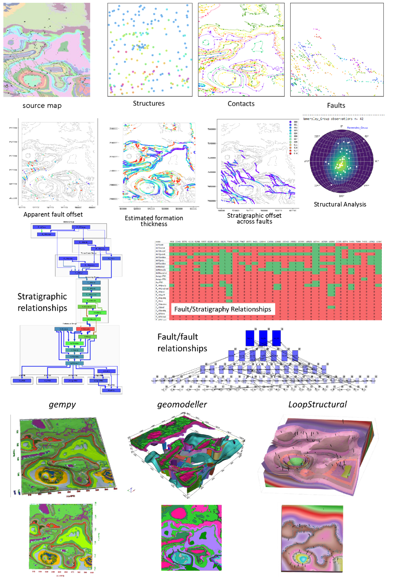

# map2loop Package

A package to extract information from geological maps to feed 3D modelling packages

#### What it does:
  
-  Combines information extracted from vector geology maps in various forms to supoprt 3D geological modelling. Outputs are simple csv files that should be readble by any 3D modelling system (I think).

#### Inputs: (example data supplied) 
   
- Geology as Polygons  
- Fault and fold axial trace as PolyLines  
- Structure measurements (bed dips)
- Graphs are created in-code from Vitaliy's map2model cpp code as Points
  
#### map2loop outputs:
   

#### map2loop outputs:

| content | filename | created by | example notebook |
| ----- | ----- | ----- | ----- |
| Various stratigraphic topology graphs  | \*/graph/\*.gml | map2model cpp code in Notebook 1 |  1 |
| Group-level stratigraphic relationships | \*/tmp/groups.csv | m2l_topology. save_group |  1 |
| Formation-level stratigraphic relationships | \*/tmp/\*_groups.csv | m2l_topology. save_units |  1 |
| Summary strat relationships | \*/tmp/all_sorts.csv or all_sorts_clean.csv| m2l_topology. save_units |  1 |
| Fault-fault relationship table | \*/output/fault-fault-relationships.csv | m2l_topology. parse_fault_relationships |  1 |
| Fault-fault relationship graph | \*/output/fault_network.gml | m2l_topology. parse_fault_relationships |  1 |
| Fault-unit relationship table | \*/output/unit-fault-relationships.csv | m2l_topology. parse_fault_relationships |  1 |
| Fault-group relationship table | \*/output/group-fault-relationships.csv | m2l_topology. parse_fault_relationships |  1 |

##### Digital Terrain Model:

| content | filename | created by | example notebook |
| ----- | ----- | ----- | ----- |
| dtm in lat long wgs83 | \*/dtm/dtm.tif | m2l_utils.get_dtm |   1 |
| georeferenced dtm | \*/dtm/dtm_rp.tif| m2l_utils.reproject_dtm |  1 |

##### Geometry:

| content | filename | created by | example notebook |
| ----- | ----- | ----- | ----- |
| Contact info with z and formation | \*/output/contacts4.csv or contacts_clean.csv| m2l_geometry. save_basal_contacts |  1 |
| Fault trace with z | \*/output/faults.csv | m2l_geometry. save_faults |  1 |
| Basal contacts shapefile | \*/tmp/basal_contacts.shp | m2l_geometry. save_basal_no_faults |  1 |
| Clipped geology map shapefile | \*/tmp/geol_clip.shp | Notebook 1 |  1 |
| Clipped fault & fold axial traces shapefile  | \*/tmp/faults_clip.shp | Notebook 1 |  1 |
| Pluton contacts with z and formation | \*/output/ign_contacts.csv | m2l_geometry. process_plutons |  1 |
| Local formation thickness estimates | \*/output/formation_thicknesses_norm.csv and formation_summary_thickness.csv| m2l_geometry. calc_thickness and normalise_thickness|  2 |
| Fault dimensions | \*/output/fault_dimensions.csv | m2l_geometry. save_faults |  1 |
| Fault displacements | \*/output/fault_displacement3.csv | Notebook 6 |  6 |

##### Orientations:

| content | filename | created by | example notebook |
| ----- | ----- | ----- | ----- |
| Bed dip dd data with z and formation | \*/output/orientations.csv or orientations_clean.csv| m2l_geometry. save_orientations |  1 |
| Extra orientations for empty series | \*/output/empty_series_orientations.csv | m2l_geometry. create_orientations |  1 |
| Fault orientation with z | \*/output/fault_orientations.csv |  m2l_geometry. save_faults |  1 |
| Clipped orientations shapefile | \*/tmp/structure_clip.shp | Notebook 1 |  1 |
| Interpolated dip dip direction grid | \*/tmp/interpolation_scipy_rbf.csv | m2l_interpolation. interpolate_orientations |  1 |
| Interpolated contact vector grid | \*/tmp/interpolation_contacts_scipy_rbf.csv | m2l_interpolation. interpolate_contacts |  1 |
| Combined interpolation grid | \*/tmp/combo_full.csv | m2l_interpolation. join_contacts_and_orientations |  1 |
| Pluton contact orientations | \*/output/ign_orientations_\*.csv | m2l_geometry. process_plutons |  1 |
| Near-Fault strat orientations | \*/tmp/ex_f_combo_full\*.csv | Notebook 6 |  6 |
| Near-Fold Axial Trace strat orientations | \*/output/fold_axial_trace_orientations2\*.csv | m2l_geometry. save_fold_axial_traces_orientations |  5 |

##### loop2model:
| content | filename | created by | example notebook |
| ----- | ----- | ----- | ----- |
| Gempy | Notebook creates 3D model itself | m2l_export. loop2gempy |  1a |
| Basic vtk model thanks to gempy  | \*/vtk/\*.vtp | gempy |  1 |
| Geomodeller | m2l.taskfile | m2l_export. loop2geomodeller |  1b  |
| LoopStructural | Notebook creates 3D model itself | m2l_export. loop2LoopStructural |  1c  |

Does not deal with sills yet.  
  
Standalone map2model cpp code from Vitaliy provides fault/fault and fault/strat relationships   

#### Installation
For the moment installation uses:  
  
pip install --index-url https://test.pypi.org/simple/ --no-deps map2loop  
or   
setup.py install
  
#### Requirements
rasterio
matplotlib
networkx
numpy
pandas
geopandas
os
urllib
sys
math
shapely
gempy
